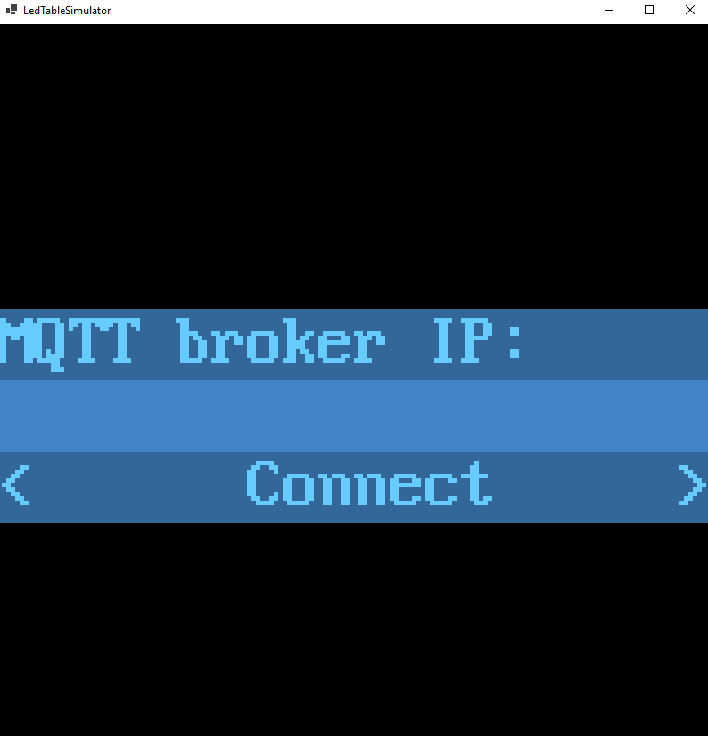

# LedTableSimulator
A simulation frontend for 10x10 RGB LED tables.

## Getting Started
1. Execute **LedTableSimulator**
2. Enter the IP address of your open MQTT server.
3. Hit ENTER or click on CONNECT.
4. Publish your framebuffers conforming to the requirements stated below to `ledtable/simulation/framebuffer`.
5. Enjoy the simulation! :-)

## Framebuffer requirements:
- Each pixel is represented by 3 bytes.
- Each byte in a single pixel represents a color value (0 - 255, where 0 is off and 255 is maximum brightness).
- The color order of each pixel is BGR (blue, green red).
- The pixel values for the whole table are represented as a byte array of size 10x10x3 bytes.
- The pixel data array of point 3 is named framebuffer from now on.
- The pixel order inside the framebuffer is as follows (snake pattern):
  - Width is 10 pixels - refered to by W.
  - Height is 10 pixel - refered to by H.
  - X and Y are coordinates on the table where x = 0 is the very left and y = 0 is the very bottom of the table.
  - The pixel order then is x0y0 .. x0yH, x1yH .. x1y0, x2y0 .. x2yH, x3yH ..x3y0 .. further to the right until xW.

## Cross-Platform
**LedTableSimulator** is based on [the MonoGame framework](https://github.com/MonoGame/MonoGame). It can be build for other platforms than Windows, as well. In order to do so, simply swap the corresponding NuGet package and re-build the project.
